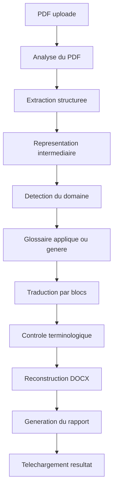

# Architecture technique

## Vue globale

DocTranslate AI est une application web composee de :

- un frontend Next.js en TypeScript ;
- une API backend FastAPI ;
- un pipeline documentaire Python ;
- un service de traduction abstrait avec provider mock et provider LLM ;
- un stockage temporaire local ;
- un generateur DOCX ;
- un rapport de validation.

Le MVP doit rester volontairement simple : pas de Celery, Redis, RabbitMQ ou orchestration distribuee. Le traitement peut etre lance avec `FastAPI BackgroundTasks` ou un mecanisme equivalent de tache en arriere-plan dans le processus backend.

## Limites strictes du MVP

Le prototype accepte uniquement :

- PDF numeriques propres ;
- texte selectionnable ;
- maximum 10 pages ;
- maximum 10 Mo ;
- tableaux simples uniquement ;
- documents a une colonne en priorite ;
- anglais vers francais.

Sont exclus du MVP :

- scans complexes ;
- OCR avance ;
- formulaires PDF complexes ;
- documents multi-colonnes complexes ;
- remplacement ou traduction de texte integre dans les images ;
- fidelite pixel-perfect ;
- export PDF obligatoire.

## Workflow cible



## Modules principaux

### Frontend

Responsabilites :

- upload du PDF ;
- affichage du statut de traitement ;
- consultation du resultat ;
- affichage du rapport de validation ;
- telechargement DOCX et PDF si disponible.

### Backend API

Responsabilites :

- recevoir les fichiers ;
- valider les entrees ;
- creer les jobs de traitement ;
- exposer les statuts ;
- servir les fichiers generes ;
- masquer les details internes au frontend.

Pour le MVP, le statut d'un job peut etre stocke en memoire ou dans un fichier JSON local sous `storage/tmp/{document_id}/status.json`. Le stockage fichier est preferable pour une demonstration car il survit mieux aux erreurs ponctuelles du processus, mais il ne remplace pas une vraie file de jobs en production.

### Pipeline documentaire

Responsabilites :

- extraire les pages, blocs, images et tableaux ;
- construire la representation intermediaire ;
- orchestrer traduction, controle et reconstruction ;
- produire les artefacts finaux.

### Services IA

Responsabilites :

- detecter le domaine du document ;
- generer un resume global ;
- traduire par blocs avec contexte ;
- appliquer les contraintes de glossaire ;
- retourner une sortie structuree et validable.

Le `TranslationService` doit exposer une interface commune et deux implementations :

- `MockTranslationProvider` : utilise pour le developpement, les tests automatises et la validation du pipeline complet sans cout IA ;
- `LLMTranslationProvider` : utilise pour un usage reel, derriere une configuration `.env`.

La variable `MOCK_TRANSLATION_ENABLED=true/false` determine le provider actif. Le mock doit etre le chemin par defaut pendant les premieres phases d'implementation.

### Stockage temporaire

Responsabilites :

- stocker les PDF sources temporairement ;
- stocker les representations intermediaires ;
- stocker les DOCX et rapports generes ;
- supprimer les fichiers expires.

Politique MVP :

```text
storage/tmp/{document_id}/
  source.pdf
  intermediate.json
  translated.docx
  report.json
  status.json
  images/
```

Les fichiers sont conserves au maximum 24 heures pour le MVP. La purge MVP peut etre lancee au demarrage du backend et de maniere opportuniste avant chaque upload. Une version future pourra utiliser un scheduler dedie. Le chemin local n'est jamais expose directement au frontend.

## Responsabilites par service backend

- `pdf_service.py` : ouverture, validation technique et lecture du PDF.
- `extraction_service.py` : extraction texte, blocs, coordonnees, images, tableaux simples.
- `translation_service.py` : interface de traduction, provider mock, provider LLM, prompts, retries.
- `glossary_service.py` : gestion des termes metier et controle terminologique.
- `reconstruction_service.py` : generation DOCX prioritaire et export PDF optionnel.
- `validation_service.py` : generation du rapport et score de confiance.
- `storage_service.py` : chemins, sauvegarde, nettoyage et recuperation des artefacts.

## Representation intermediaire

La representation intermediaire est le contrat central du systeme. Elle doit contenir :

- metadonnees du document ;
- pages contenant directement leurs blocs ;
- styles approximatifs ;
- ordre de lecture ;
- texte source ;
- texte traduit ;
- alertes par bloc ;
- liens vers images extraites si necessaire.

Pour eviter une complexite excessive dans le MVP, les tableaux et images sont modelises comme des blocs. Un bloc de type `table` contient directement ses `rows` et `cells`. Un bloc de type `image` contient ses metadonnees et son chemin interne d'image extraite.

## Generation de documents

La generation DOCX est le livrable prioritaire du MVP car elle produit un fichier editable et demonstrable. L'export PDF est optionnel : son absence ne bloque pas la validation du MVP. Il peut etre ajoute plus tard via LibreOffice headless ou une conversion serveur lorsque l'environnement est stable.

## Rapport de validation

Le rapport doit indiquer clairement :

- blocs non traduits ;
- textes potentiellement debordants ;
- tableaux suspects ;
- images contenant possiblement du texte ;
- termes de glossaire absents ou incoherents ;
- score de confiance global.
